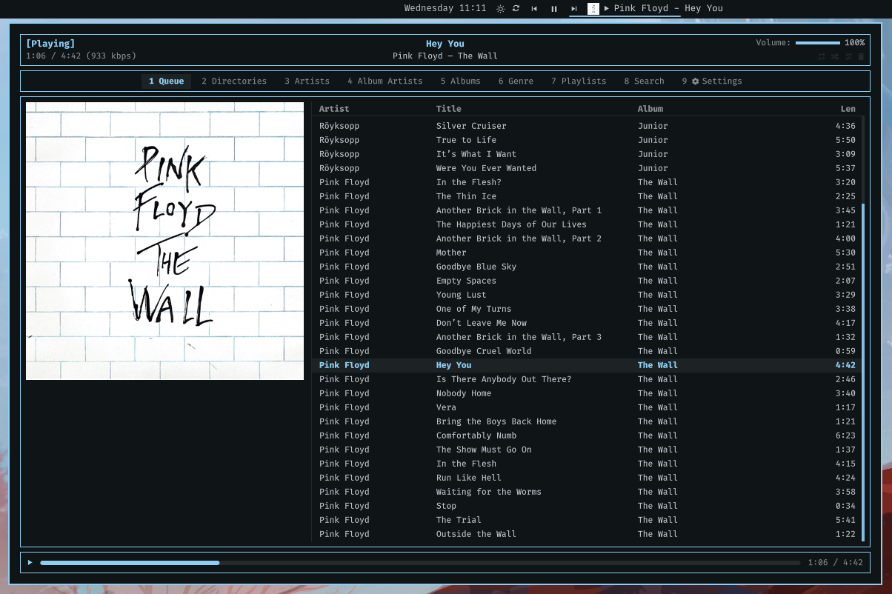

# omajam

An [MPD](https://musicpd.org) client for the [Omarchy](https://omarchy.org)
Quattro bar: what's playing in the bar, and a window behind it holding the
queue, your library, your playlists and a search box, laid out like
[rmpc](https://github.com/mierak/rmpc) and using the same keys.



> **Written by Claude**, Anthropic's coding agent. Omarchy plugins run
> unsandboxed inside your shell process, with your permissions. Read the source
> first. No promises about your record collection.

## Features

- Nine tabs — queue, directories, artists, album artists, albums, genre,
  playlists, search, settings — with the cover and progress bar always visible.
- rmpc's default keybindings. `?` lists them.
- Three-column library browser, with the preview column fetched ahead. On a
  song it shows the cover and every tag the server holds.
- Bar label in mpc's format dialect, with a live preview in the settings tab.
- Driven by MPD's `idle` push, so nothing polls.
- TCP or unix socket, with a password, or whatever `$MPD_HOST` says.
- Optional notification on track change, with the cover.
- Reconnects on its own, and shows the server's error while it can't.
- Scriptable through `omarchy-shell`.

Colours, fonts and spacing come from the shell's theme tokens.

Needs python3, which Arch already has. No `mpc` and no libmpdclient: the plugin
speaks the MPD protocol itself.

## Install

```bash
omarchy plugin add https://github.com/matjam/omajam.git --enable
```

Choose `left`, `center` or `right` when prompted; the window opens centred
either way. Move it later from the bar's settings or `bar.layout` in
`~/.config/omarchy/shell.json`.

```bash
omarchy plugin update matjam.omajam    # update
omarchy plugin remove matjam.omajam    # remove, leaves nothing behind
```

Omarchy's built-in `omarchy.media` widget is MPRIS-based and knows nothing
about MPD. The two can coexist.

## The window

Click the label in the bar, or `omarchy-shell matjam.omajam client`.

| Tab | | |
| --- | --- | --- |
| `1` | Queue | What is playing, in order, with the cover beside it. |
| `2` | Directories | Your music tree as it is on disk. |
| `3` | Artists | Artist → album → track. |
| `4` | Album Artists | The same, by album artist. |
| `5` | Albums | Every album, then its tracks. |
| `6` | Genre | Genre → album → track. |
| `7` | Playlists | Stored playlists and their contents. |
| `8` | Search | Every tag at once, as you type. |
| `9` | Settings | The plugin's, and the server's. |

### Keys

These are rmpc's defaults.

| | | | |
| --- | --- | --- | --- |
| `j` `k` | move | `p` | play / pause |
| `g g` | top | `s` | stop |
| `G` | bottom | `<` `>` | previous / next |
| `^u` `^d` | half a page | `f` `b` | seek ±5s |
| `^b` `^f` | a page | `.` `,` | volume ±5 |
| `h` `l` | out of / into | `z` | repeat |
| `enter` | play it | `x` | random |
| `a` `A` | add / add all | `c` | consume |
| `d` `D` | delete / clear the queue | `v` | single |
| `space` | mark a row | `u` `U` | update / rescan the database |
| `/` `n` `N` | find, again, back | `tab` `1`–`9` | switch tab |
| `J` `K` | move a song in the queue | `C` | jump to what is playing |
| `X` | shuffle the queue | `i` | the search box |
| `?` | the key list | `q` `esc` | close |

Search puts the cursor in the box, so keys type until `esc` returns them to
the results. `tab` still switches tabs from inside it.

`a` acts on the marked rows, or the row under the cursor when none are marked.
Adding an artist or album sends one filter rather than a line per song.

Mouse: click to select, double-click to play, click the progress bar to seek,
click the header glyphs to toggle playback options. The wheel moves ten rows a
notch, and the scrollbar can be dragged.

## In the bar

| | |
| --- | --- |
| Left click the label | Open the window |
| Middle click | Next track |
| Right click | Open the window on its settings tab |
| Scroll | Volume, seek or skip, whichever you chose |
| Hover | Cover art, album, and how far through you are |

The transport buttons play, pause and skip without opening anything. The cog
opens the settings tab.

## Settings

Tab `9`, or the cog in the bar.

**Server** — host, port, password, and what the connection is doing, including
the server's error when it refuses. **Reconnect** restarts it. **Update
database** reads files whose
timestamps changed; **Rescan everything** re-reads every file, for tags edited
in place. `u` and `U` do the same from anywhere in the window. MPD reports that
a scan is running but not how far along.

`$MPD_HOST` is read in full, including its `password@host` form, but only while
the host field is empty.

**Label format** — see [Format](#format), with a live preview.

**In the bar** — label width, scroll or elide, which parts of the strip to
show, what to do when nothing is playing, and what the scroll wheel does.

For the cover alone as the widget's icon, turn the cover thumbnail on, the play
state glyph off, and clear the label format. The cover then sizes up to stand
in for the icon other widgets have, and the glyph comes back on its own when
nothing is playing. Right-click still opens the settings, so the cog can go
too.

**Notify on track change** — off by default. Sends a desktop notification with
the cover, the title and the artist and album, through the shell's own
notification server, so it lands where your notifications go and respects
do-not-disturb. Each one replaces the last rather than stacking, and nothing is
announced for the song already playing when the shell starts.

MPD's own playback options aren't here: repeat, random, single and consume are
glyphs in the window's header, and `z`/`x`/`c`/`v` from anywhere in it.

## Format

The label format is mpc's, so one copied from a status-bar script mostly works
unchanged.

| | |
| --- | --- |
| `%tag%` | Substituted, empty when the tag is missing. |
| `[ … ]` | Dropped entirely unless every `%tag%` inside it resolved. |
| `[ a \| b ]` | Alternatives. The first branch that resolves wins. |
| `%%`, `\x` | A literal percent, a literal `x`. |

`[%artist% - ]%title%` loses the dash along with the artist rather than leaving
a title starting with one, and `[%title%|%filename%]` falls back to the
filename for an untagged track.

Outside brackets a missing tag leaves a hole and `|` is an ordinary character,
so `%artist% | %title%` is a separator.

Tags: `artist` `albumartist` `title` `album` `track` `disc` `date` `genre`
`composer` `performer` `comment` `name` `file` `filename` `folder` `state`
`stateicon` `elapsed` `duration` `remaining` `time` `position` `length`
`volume` `bitrate` `audio` `repeat` `random` `single` `consume`

`name` is a radio stream's name, the only title many of them carry. `filename`
is the basename without its extension; `folder` is the directory inside your
music library.

Some to steal:

```
%stateicon% [%artist% - ]%title%          ▶ Wire - Another the Letter
[%artist% — ]%title%[ (%date%)]           Wire — Another the Letter (1978)
[%title%|%filename%][  ·  %time%]         Another the Letter  ·  0:41/4:14
[%name%|%artist% - %title%|%filename%]    radio first, then tags, then the file
%title%[  ·  %position%/%length%]         Another the Letter  ·  3/17
```

Formats containing `%elapsed%`, `%remaining%` or `%time%` update once a second.
MPD reports elapsed only when something changes, so the clock is carried
forward locally and reset by every update.

## From the command line

```bash
omarchy-shell -q mpd toggle          # play/pause
omarchy-shell -q mpd next            # and previous, stop, play, pause
omarchy-shell -q mpd volume +5       # a sign nudges, a bare number sets
omarchy-shell -q mpd seek 90         # absolute, in seconds
omarchy-shell -q mpd option random   # repeat, random, single, consume
omarchy-shell -q mpd clear           # and shuffle, crop
omarchy-shell -q mpd add "Wire/Pink Flag"
omarchy-shell -q mpd load "Friday"   # a stored playlist
omarchy-shell -q mpd update          # read the files that changed
omarchy-shell -q mpd rescan          # re-read every file in the library
omarchy-shell mpd status             # JSON state
omarchy-shell mpd queue              # JSON queue
omarchy-shell matjam.omajam client   # the window
omarchy-shell matjam.omajam settings # the window, on its settings tab
omarchy-shell matjam.omajam search "kate bush"
omarchy-shell matjam.omajam key a    # any key the window takes
omarchy-shell matjam.omajam key esc  # named keys: esc enter tab space
                                     # up down left right pgup pgdn home end
omarchy-shell matjam.omajam state    # what the window is showing, as JSON
```

Binds go in `~/.config/hypr/bindings.lua`:

```lua
o.bind("SUPER + M", "omajam", "omarchy-shell matjam.omajam client")
o.bind("SUPER + SHIFT + M", "omajam settings", "omarchy-shell matjam.omajam settings")

o.bind("XF86AudioPlay", "Play/pause", "omarchy-shell -q mpd toggle", { locked = true })
o.bind("XF86AudioNext", "Next track", "omarchy-shell -q mpd next", { locked = true })
o.bind("XF86AudioPrev", "Previous track", "omarchy-shell -q mpd previous", { locked = true })
```

`locked = true` keeps the transport keys working on the lock screen. The window
opens on the monitor with focus, wherever the widget itself lives.

## How it works

Quickshell's `Socket` is a `QLocalSocket`, so it does unix sockets only, and
MPD is usually on TCP. The connection lives in a python child process,
[`bin/omajam-mpd`](bin/omajam-mpd). The shell and the bridge exchange one line
of JSON at a time: settings, commands and queries down; state and answers back.

The bridge holds three connections: one parked in `idle`, one for commands and
status, and one for the window's browsing queries, so a `search` across ten
thousand songs is not felt on the play button. Album art gets a fourth,
short-lived one.

Queries carry a channel, and a query superseded by a newer one on the same
channel is dropped, so typing in the search box costs one query rather than one
per keystroke.

The connection belongs to the plugin's *service*, one per shell rather than one
per monitor: the widget is instantiated on every screen, and three of them would
open three connections. Each reads the service back through `shell.serviceFor()`.

Covers are cached under `~/.cache/omajam`, keyed by album so a whole record
costs one fetch, and pruned to the most recent 96.

<details>
<summary><b>Album art</b></summary>

`albumart` returns the cover file beside the song, `readpicture` whatever is
embedded in the tags. The bridge tries the first and falls back to the second;
a track with neither gets a placeholder.

Both return the image in chunks of `binarylimit` bytes, 8KB by default. The
bridge raises that to 256KB on its art connection, turning a 3MB cover from 400
round trips into 12. Servers older than 0.22 reject the command and keep their
default.

</details>

<details>
<summary><b>Old servers</b></summary>

MPD 0.21 introduced the filter expression — `find "((artist == 'Wire'))"` — and
has been deprecating the older tag/value form since. The bridge writes whichever
the server understands, because 0.20 is still what some NAS boxes ship.

</details>

## Requirements

Omarchy Quattro · python3 (already installed on Arch) · an MPD server, which
can be on another machine.

No network access beyond the MPD connection you configure, nothing written
outside `~/.cache/omajam`, and no dependency on `mpc` or libmpdclient.

**Your password is stored as plain text** in `~/.config/omarchy/shell.json`,
like every other shell setting, and is sent to MPD in the clear unless you
tunnel it. Leave the field empty and use `$MPD_HOST=password@host` to keep it
in your environment instead. The bridge is given its settings over stdin rather
than argv, so the password is not visible in `ps`.

MIT — see [LICENSE](LICENSE).
